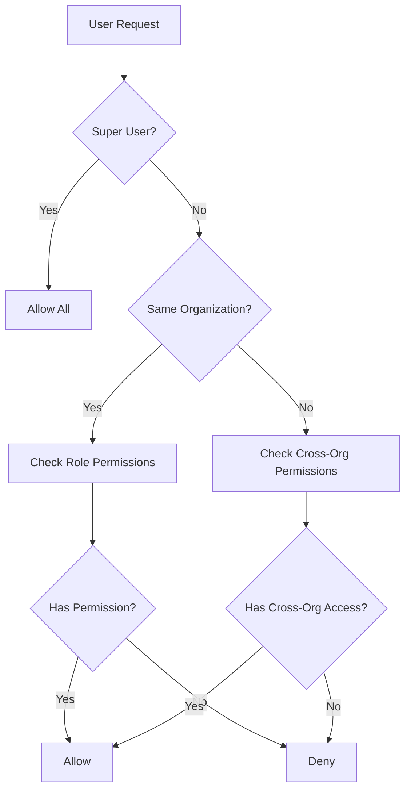

# Multi-Tenant RBAC + ABAC Implementation Strategy

## Overview

This document outlines the implementation strategy for transitioning the Patunay Admin application from a simple 2-role system to a comprehensive multi-tenant, role-based access control (RBAC) system with attribute-based access control (ABAC) capabilities.

## Current State vs. Target State

### Current State
- **Roles**: 2 roles (admin, staff)
- **Scope**: Single organization implied
- **Permissions**: Basic role-based permissions
- **Access Control**: Simple role checks

### Target State
- **Roles**: 6 roles (super_user, admin, issuer, appraiser, staff, viewer)
- **Scope**: Multi-tenant with organizational boundaries
- **Permissions**: Hierarchical RBAC + cross-organizational ABAC
- **Access Control**: Context-aware permission system

## Implementation Phases

### Phase 1: Database Schema Migration (CRITICAL - COMPLETE FIRST)

**Status**: ✅ Complete - Migration file created

**Tasks**:
1. ✅ Run the migration: `20250626_multi_tenant_rbac_schema.sql`
2. ✅ Verify all new tables are created
3. ✅ Test new enums and constraints
4. ✅ Migrate existing data to new structure

**Key Changes**:
- Added `organizations` table
- Added `organization_users` many-to-many relationship
- Added `cross_org_permissions` for ABAC
- Updated `profiles` table with new role enum
- Added organization context to `artworks` and `tags`

**Data Migration Steps**:
```sql
-- 1. Create default organization for existing data
INSERT INTO public.organizations (name, type, description)
VALUES ('Default Organization', 'other', 'Migration organization for existing data');

-- 2. Update existing artworks and tags
UPDATE public.artworks SET organization_id = (SELECT id FROM public.organizations LIMIT 1);
UPDATE public.tags SET organization_id = (SELECT id FROM public.organizations LIMIT 1);

-- 3. Create organization memberships for existing users
INSERT INTO public.organization_users (organization_id, user_id, role, is_primary, is_active)
SELECT 
  (SELECT id FROM public.organizations LIMIT 1),
  p.id,
  p.role,
  true,
  p.is_active
FROM public.profiles p;
```

### Phase 2: Backend API Updates

**Priority**: HIGH
**Estimated Time**: 2-3 days

**Tasks**:
1. **Update User Management API**
   - Modify user creation to include organization context
   - Update user queries to include organization relationships
   - Add organization-scoped user listing

2. **Create Organization Management API**
   - CRUD operations for organizations
   - Organization membership management
   - Cross-organizational permission management

3. **Update Artwork and Tag APIs**
   - Add organization filtering
   - Implement organization-scoped queries
   - Update RLS policies

4. **Implement Access Control Functions**
   - Create permission checking utilities
   - Implement context-aware access control
   - Add role hierarchy validation

**API Endpoints to Add/Update**:
```typescript
// Organizations
GET    /api/organizations              // List user's organizations
POST   /api/organizations              // Create new organization (super_user only)
GET    /api/organizations/:id          // Get organization details
PUT    /api/organizations/:id          // Update organization
DELETE /api/organizations/:id          // Delete organization

// Organization Memberships
GET    /api/organizations/:id/users    // List organization users
POST   /api/organizations/:id/users    // Add user to organization
PUT    /api/organizations/:id/users/:userId  // Update user role/permissions
DELETE /api/organizations/:id/users/:userId  // Remove user from organization

// Cross-Org Permissions
GET    /api/users/:id/cross-org-permissions     // List user's cross-org permissions
POST   /api/users/:id/cross-org-permissions     // Grant cross-org permission
DELETE /api/cross-org-permissions/:id           // Revoke cross-org permission

// Updated Endpoints
GET    /api/artworks?organization_id=:id        // Organization-scoped artworks
GET    /api/tags?organization_id=:id            // Organization-scoped tags
GET    /api/users?organization_id=:id           // Organization-scoped users
```

### Phase 3: Frontend Authentication & Authorization

**Priority**: HIGH
**Estimated Time**: 3-4 days

**Tasks**:
1. **Update Authentication Context**
   - Extend `useAuth` hook for multi-tenant support
   - Add organization context to session
   - Implement role hierarchy checks

2. **Create Organization Components**
   - Organization selector/switcher
   - Organization management interface
   - User invitation and role management

3. **Update Navigation & Routing**
   - Add organization-aware route guards
   - Filter navigation based on user permissions
   - Implement breadcrumb with organization context

4. **Update User Management UI**
   - Add organization filtering
   - Role assignment with hierarchy validation
   - Cross-organizational permission management

**Key Components to Create/Update**:
```typescript
// New Components
<OrganizationSwitcher />
<OrganizationManagement />
<CrossOrgPermissions />
<RoleHierarchySelector />

// Updated Components
<UserTable />           // Add organization filtering
<UserForm />            // Add organization and role selection
<Sidebar />             // Filter based on permissions
<DashboardLayout />     // Add organization context
```

### Phase 4: Advanced Access Control Implementation

**Priority**: MEDIUM
**Estimated Time**: 2-3 days

**Tasks**:
1. **Implement Permission System**
   - Create permission checking hooks
   - Add component-level permission guards
   - Implement field-level access control

2. **Add Cross-Organizational Features**
   - Issuer workflow for cross-org NFC tagging
   - Appraiser workflow for cross-org appraisals
   - Permission request/approval system

3. **Create Audit System**
   - Track permission changes
   - Log cross-organizational access
   - Generate access reports

**Permission Checking Examples**:
```typescript
// Hook usage
const { canPerform, hasOrgRole } = usePermissions();

// Component-level guards
<PermissionGuard permission="manage_org_users">
  <UserManagementPanel />
</PermissionGuard>

// Conditional rendering
{canPerform('manage_nfc_tags', artwork.organization_id) && (
  <AttachNFCButton artwork={artwork} />
)}

// Role-based access
{hasOrgRole('admin', organization.id) && (
  <OrganizationSettings />
)}
```

### Phase 5: Testing & Validation

**Priority**: HIGH
**Estimated Time**: 2-3 days

**Tasks**:
1. **Unit Tests**
   - Permission checking functions
   - Role hierarchy validation
   - Organization context handling

2. **Integration Tests**
   - Cross-organizational workflows
   - Permission inheritance
   - Data isolation between organizations

3. **End-to-End Tests**
   - Complete user workflows
   - Role-based navigation
   - Permission enforcement

4. **Security Testing**
   - RLS policy validation
   - Permission bypass attempts
   - Data leakage testing

### Phase 6: Documentation & Migration

**Priority**: MEDIUM
**Estimated Time**: 1-2 days

**Tasks**:
1. **Update Documentation**
   - API documentation
   - User role descriptions
   - Permission matrices

2. **Create Migration Guide**
   - Existing user transition
   - Organization setup guide
   - Role assignment procedures

3. **Admin Training Materials**
   - Organization management
   - User role assignment
   - Cross-organizational permissions

## Access Control Logic

### Permission Resolution Flow



### Role Permission Matrix

| Role | Scope | Key Permissions |
|------|-------|-----------------|
| **Super User** | Global | All permissions across all organizations |
| **Admin** | Organization | Manage users, artworks, NFC tags within org |
| **Issuer** | Cross-Org | Issue NFC tags, manage artworks they create |
| **Appraiser** | Cross-Org | Add appraisals to authorized artworks |
| **Staff** | Organization | Manage artworks, limited NFC access |
| **Viewer** | Limited | View basic artwork info, no appraisals |

### Cross-Organizational Access Patterns

1. **Issuer Access**
   - Artists issuing tags for gallery artworks
   - Gallery issuing tags for client collections

2. **Appraiser Access**
   - Independent appraisers working for multiple organizations
   - Institutional appraisers with external contracts

3. **Viewer Access**
   - Public exhibitions
   - Research collaborations

## Security Considerations

### Row Level Security (RLS)
- All tables have organization-scoped RLS policies
- Cross-organizational access requires explicit permissions
- Super user bypass for system administration

### Permission Validation
- Client-side validation for UX
- Server-side enforcement for security
- Database-level constraints for data integrity

### Audit Trail
- All permission changes logged
- Cross-organizational access tracked
- Role assignments audited

## Performance Considerations

### Database Optimization
- Indexes on organization_id columns
- Efficient permission checking queries
- Materialized views for complex permissions

### Caching Strategy
- Cache user permissions per organization
- Cache organization memberships
- Invalidate on role/permission changes

### Query Optimization
- Use joins instead of multiple queries
- Batch permission checks
- Optimize RLS policy performance

## Migration Rollback Plan

### Database Rollback
1. Backup current database
2. Create rollback migration script
3. Test rollback in staging environment

### Application Rollback
1. Feature flags for new functionality
2. Gradual rollout by organization
3. Quick disable switches for new features

### Data Recovery
1. Export organization data before migration
2. Maintain data mapping for rollback
3. Verify data integrity after rollback

## Success Metrics

### Technical Metrics
- Database query performance maintained
- API response times under 200ms
- Zero data leakage between organizations

### Business Metrics
- Successful multi-organization onboarding
- Reduced support tickets for access issues
- Increased cross-organizational collaboration

### User Experience Metrics
- Intuitive role assignment interface
- Clear permission error messages
- Seamless organization switching

## Timeline Summary

| Phase | Duration | Dependencies |
|-------|----------|--------------|
| Phase 1: Database | 1 day | None |
| Phase 2: Backend API | 2-3 days | Phase 1 complete |
| Phase 3: Frontend Auth | 3-4 days | Phase 2 complete |
| Phase 4: Advanced Features | 2-3 days | Phase 3 complete |
| Phase 5: Testing | 2-3 days | Phase 4 complete |
| Phase 6: Documentation | 1-2 days | Phase 5 complete |

**Total Estimated Time**: 11-16 days

## Next Steps

1. **Immediate (Day 1)**
   - Review and approve migration script
   - Run database migration in staging
   - Test basic organization functionality

2. **Week 1**
   - Complete backend API updates
   - Implement basic frontend authentication changes
   - Test organization creation and user assignment

3. **Week 2**
   - Complete frontend UI updates
   - Implement cross-organizational features
   - Comprehensive testing and validation

4. **Week 3**
   - Production deployment
   - User training and documentation
   - Monitor and address issues

## Risk Mitigation

### Technical Risks
- **Database migration failure**: Test extensively in staging
- **Performance degradation**: Load testing with realistic data
- **Data loss**: Comprehensive backup strategy

### Business Risks
- **User confusion**: Gradual rollout with training
- **Access issues**: Clear escalation procedures
- **Adoption resistance**: Demonstrate clear benefits

### Security Risks
- **Permission bypass**: Comprehensive security testing
- **Data leakage**: Verify RLS policies thoroughly
- **Privilege escalation**: Test role hierarchy enforcement